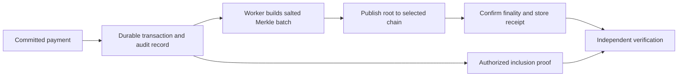

# Rail V2 Foundation

Implemented on `codex/rail-v2-foundation`, starting 8 October 2026. This document describes working modules and their limits. The complete platform roadmap remains in the ignored private scope file. [SECURITY_REVIEW.md](./SECURITY_REVIEW.md) tracks the remaining defects.

## Payment behavior

The existing flow remains: authenticate, reserve funds and persist authorization, optionally issue device-bound offline headroom, execute or sync, consume reservation and write debit/credit ledger rows. Offline features remain part of V2.

The transaction-ID-derived risk placeholder has been removed. There is currently no enforced fraud policy. Authentication, stored authorization, balance and offline-token checks still apply. ML cannot substitute for these checks or independently approve a payment.

## Trainable ML baseline

`src/risk/logisticRisk.ts` implements logistic regression using batch gradient descent on binary cross-entropy, with L2 regularization. No ML framework or external inference API is needed for this small baseline.

Two features are used: log-scaled transaction amount in minor units and an offline-channel indicator. The third weight is the intercept. Currency is declared by the dataset/model; a model is observed only for matching-currency transactions. This avoids silently treating different currencies as comparable amounts. IDs are excluded so choosing a transaction ID does not choose a risk score.

For features `x` and weights `w`, the model computes `z = sum(w[i] * x[i])`, then `p = 1 / (1 + exp(-z))`. Training adjusts weights from labeled examples rather than assigning arbitrary coefficients. Feature contributions explain the log-odds calculation; they do not establish causation.

### Dataset contract

The input JSON requires `modelVersion`, `datasetId`, `currency`, `synthetic`, and separate `training` and `validation` arrays. Each array item contains `amountMinor`, `channel`, and `label` (0 for legitimate, 1 for confirmed fraud). Training needs at least ten rows and both classes; validation needs both classes. These minimums verify the algorithm can run, not that the dataset is sufficient for fraud modeling.

Example shape, with a deliberately synthetic tiny dataset:

```json
{
  "modelVersion": "experiment-001",
  "datasetId": "synthetic-demo",
  "currency": "INR",
  "synthetic": true,
  "training": [
    {"amountMinor": 100, "channel": "online", "label": 0},
    {"amountMinor": 200, "channel": "online", "label": 0},
    {"amountMinor": 300, "channel": "online", "label": 0},
    {"amountMinor": 400, "channel": "online", "label": 0},
    {"amountMinor": 500, "channel": "online", "label": 0},
    {"amountMinor": 1000000, "channel": "nfc", "label": 1},
    {"amountMinor": 1100000, "channel": "ble", "label": 1},
    {"amountMinor": 1200000, "channel": "qr", "label": 1},
    {"amountMinor": 1300000, "channel": "nfc", "label": 1},
    {"amountMinor": 1400000, "channel": "qr", "label": 1}
  ],
  "validation": [
    {"amountMinor": 150, "channel": "online", "label": 0},
    {"amountMinor": 1250000, "channel": "ble", "label": 1}
  ]
}
```

Train using an existing dataset path and a new output path:

```bash
npm run risk:train -- /private/path/dataset.json /private/path/model.json
```

The command writes a model artifact with provenance and weights, refuses to overwrite an existing output file, and prints validation metrics. Real datasets must be protected outside the repository. Do not label operational events as confirmed fraud without a reliable outcome source.

### Evaluation and deployment

Log loss measures confidence in the correct label. Brier score measures squared probability error. Precision and recall are reported at threshold 0.5; this is an experiment threshold rather than a payment policy. Temporal split, customer leakage prevention, class imbalance, calibration, threshold costs and drift monitoring still require dedicated validation. The command accepts supplied splits; it cannot establish their independence or verify the truth of the labels.

`RAIL_RISK_MODEL_PATH` points to a validated model JSON loaded once at server-context creation. An invalid configured model stops initialization. Without this variable, there is no ML inference. No default trained model is shipped because this repository contains no validated real fraud dataset.

For a matching currency, the pipeline appends `risk.shadow_assessed` with mode, probability, model version, synthetic-data status and contributions. The event is visible only to the sender under the existing event filter. It does not alter execution decisions. The existing outbox durability gap still applies to this observation; it must be fixed before depending on it for audit or training capture.

The tests use synthetic examples to verify learning, evaluation, validation and independence from transaction IDs. Their results say nothing about fraud detection accuracy on real transactions.

## Audit commitment foundation

`src/crypto/auditCommitment.ts` implements salted SHA-256 transaction commitments, Merkle batch roots and inclusion proof verification. Version prefixes separate leaf, internal-node and root hashing. Leaf encoding uses a JSON array, avoiding ambiguous delimiter concatenation. The root binds the batch count; odd levels duplicate the final node deterministically.

Generate a distinct salt for each payment using `randomBytes(32).toString("hex")`. Keep salts, transaction details and proofs in protected storage. Publishing the root alone avoids putting wallet identifiers, amounts or credentials on-chain. Salt format validation cannot prove callers generated random, non-reused salts.



This diagram is the integration design. Only commitment/proof computation is implemented. There is no chain client, contract, scheduled batcher, durable salt/proof table, wallet funding, external checkpoint or finality tracker yet. Roots are not currently inserted automatically during payment execution.

Anchoring must run after financial commit. A chain outage must delay an audit anchor rather than reverse a completed payment. Reorganizations need confirmation policy and re-anchoring. An independent verifier must have a trusted root/checkpoint; a database administrator can rewrite a locally stored tree and its root together.

A valid proof shows inclusion of the supplied commitment under a trusted root. It does not establish settlement, authorization validity, correctness of the input data or completeness of the batch. Merkle roots are not encryption. Clients should receive proofs only for records they are permitted to inspect.

## Why these choices

Small TypeScript modules keep the algorithm understandable and avoid a network dependency on the payment path. A measured need can justify a separate model service or different runtime later. PostgreSQL remains the current financial source of truth; a public audit anchor supplements it.

Model probability calibration should be validated before probability-based decisions: [scikit-learn calibration documentation](https://scikit-learn.org/stable/modules/calibration.html). Public blockchain records and associated metadata need careful privacy design: [Ethereum privacy overview](https://ethereum.org/privacy/ethereum).
